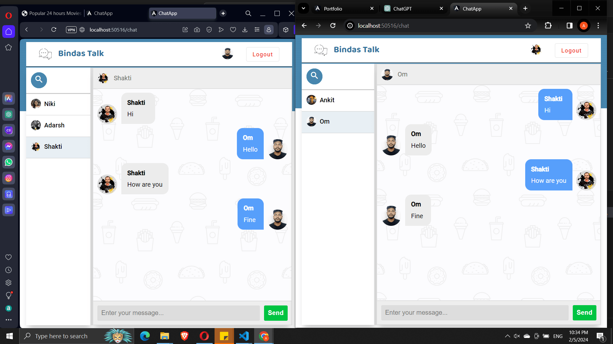
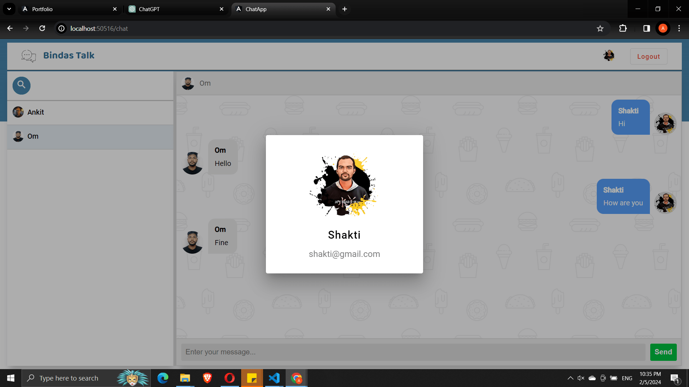
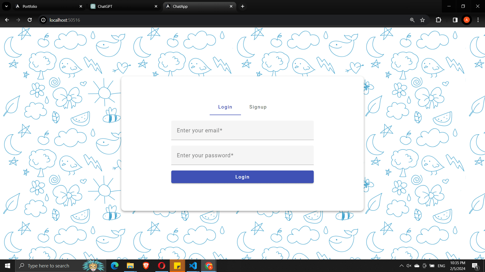

# Bindas Talk

Bindas Talk is a chat application designed to provide a seamless and engaging chat experience. Bindas Talk offers real-time messaging, unseen message notifiction, typing status, user registration, and login functionalities.

## Features

- User Registration
- User Login
- Real-Time Messaging
- Typing status
- Notification

## Technologies Used

- Angular
- Node.js
- MongoDB
- Socket.io

### Conversation Page Preview

### Profile Preview

### Login Preview

